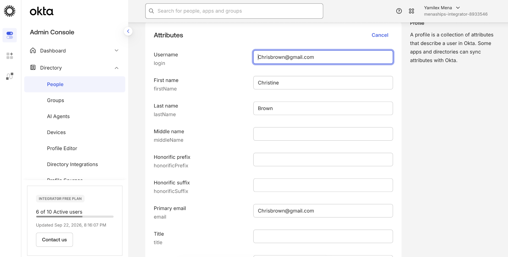
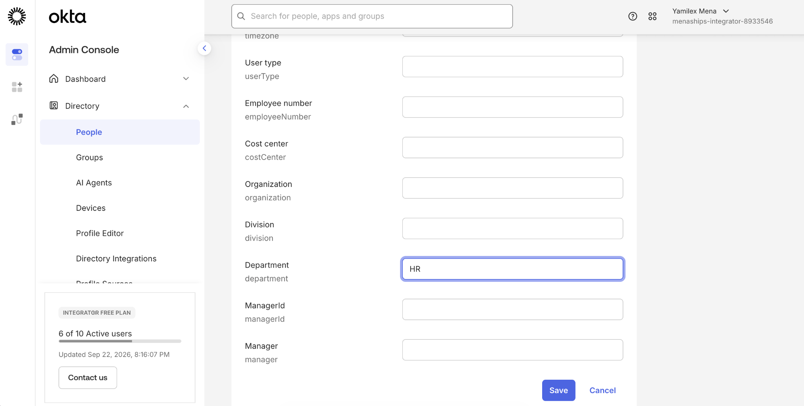
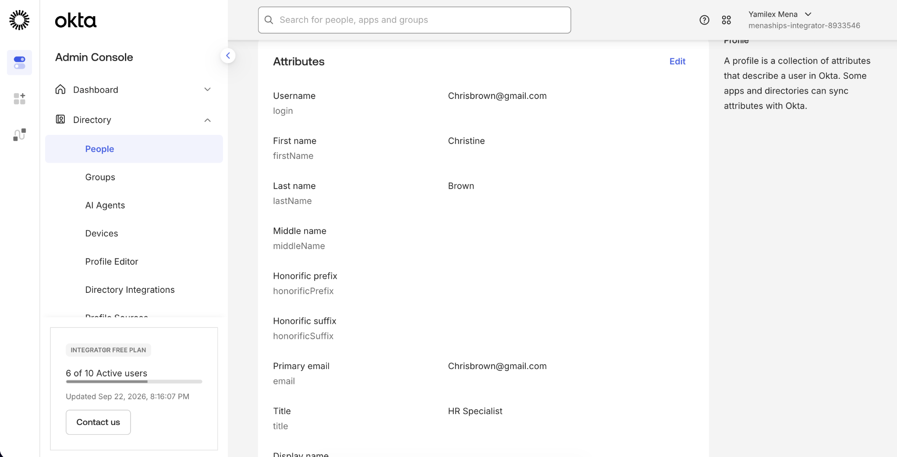
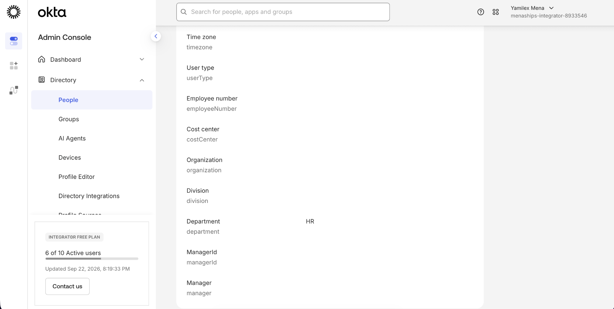

# Add Attributes to User Profiles

## Objective

Update an Okta user profile with additional identity attributes and verify that the changes were successfully saved.

## Step 1: Edit the User Profile

Opened Christine Brown's Okta profile and selected the option to edit her user attributes.

## Step 2: Add a Department Attribute

Updated the user's Department attribute to **HR**.

## Step 3: Verify the Job Title Attribute

Confirmed that the user's Title attribute was saved as **HR Specialist**.

## Step 4: Verify the Department Attribute

Confirmed that the Department attribute was successfully saved as **HR**.

## Skills Demonstrated

- Okta Administration
- User Profile Management
- Identity Attribute Management
- User Attribute Updates
- Identity and Access Management
- Attribute-Based Administration
